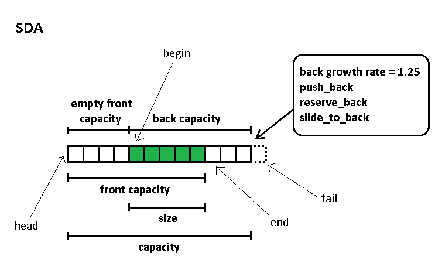
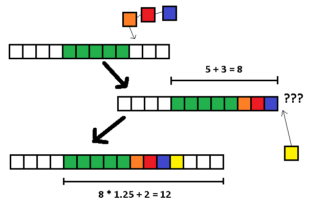
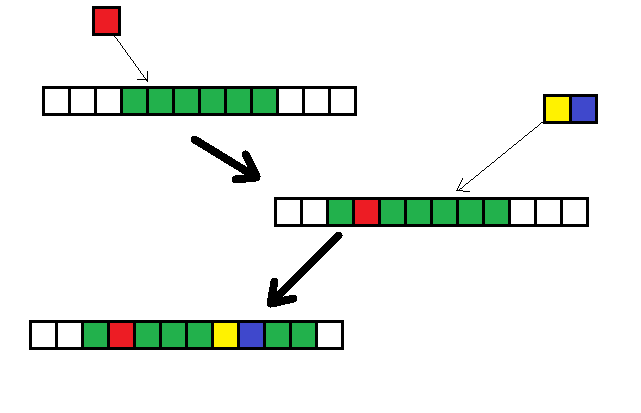

## SYMMETRIC DYNAMIC ARRAY (SDA)

**SDA** is a dynamic array, which can reserve memory at both ends, makes it also a (partly) double ended queue. 


<br/>
<br/>
<br/>

### CHARACTERISTICS:

This picture below will explain general concepts of this data structure:




1. **SMART PUSH / POP**

   Using 4 pointers to keep track of memory 

   Only grows memory in respective pushing direction. Generally with the default growth rate, pushing into **SDA** will be slower than normal dynamic array without reserved memory


<br/>
<br/>
2. **VERY FAST INSERT / ERASE** 

   Random insert/erase is the true strength of this data structure 

   Never moves more than half array (except when reallocation is needed and **join** functions) 
   
   
<br/>
<br/>


3. **SYMMETRIC DATA STRUCTURE**

   This data structure is symmetric, because operations at position *p* are as fast as operations at position *(size - p)*

   Example:

   - Insert 1,000,000 times at position *size()/4* and *size() - size()/4*

   (File: test/symmetric1.cpp)
   
   ```c++
   time1 = 14.2375 s
   time2 = 14.0634 s
   ```
   
   - Erase 300,000 times at position *size()/4* and *size() - size()/4* from array has 1,000,000 integers
   
   (File: test/symmetric2.cpp)
   
   ```c++
   time1 = 7.49209 s
   time2 = 7.48983 s
   ```
   
<br/>  
<br/>
<br/>
<br/>


### IMPLEMENTATION

**sda** is a C++ implementation of this data structure, using C++ standard only

- #### BENCHMARK:

See **BENCHMARK.md** for performance (execution time + memory usage)

If you want to check those test cases, I suggest choosing a big case, so that the difference in performance will be clearer. Besides I only use **clock()** from **time.h** so anyone can easily do themselves without having to install a big graph library. Most tests run at least one second to serveral minutes, so be patient.

- #### INSTALL:

1. Compiler: Require **C++17** support :         
     **g++ 7.5.0**            
     **clang 6.0.0**
2. Include **sda.h** in your program/project and use.

- #### GUIDE:

**GUIDE.md :**   detailed explanation with examples of some notable functions. PLEASE read it before you ask any question.

- #### OTHER:

**/deque2 :** used to find deque's capacity, read **/deque2/DEQUE2.md** for further instructions.

**/test :**  sample tests

**LIST.md :** List of all member functions

- #### LICENSE:

MIT License

Author: Than Minh Duy

Contact: duythan@protonmail.com

   

