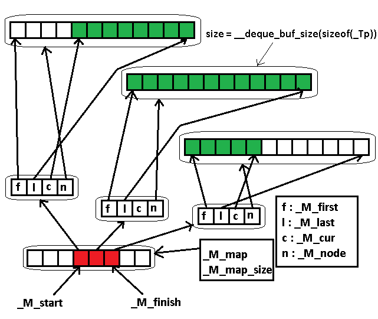

### CAPACITY OF DEQUE (LIBSTDC++)


- This is a very troublesome data structure, I haven't found any articles discussing its internal memory layout. So I had to dig through all their codes to understand its logic (with some little help from Internet of course)

This data structure can be summaried in this picture:





Anyway, to find out its capacity, we have to calculate :

```c++
(_M_finish._M_node - _M_start._M_node + 1) * __deque_buf_size(sizeof(_Tp))
```

There're 3 solutions:

1. Directly inject this code somewhere into deque of **libstdc++** (not recommended)
2. Copy its struct *_Deque_impl* data (*_M_impl*) (this struct encapsulates its internal memory layout through 4 variables: *M_start, _M_finish, _M_map, _M_map_size*), though this struct is declared **protected**. So we have to create a child class.
3. The easiest way: Define a class inherited from deque and use move constructor to steal all data, then write a function to print the capacity. (read *deque2.cpp* for definition and example)